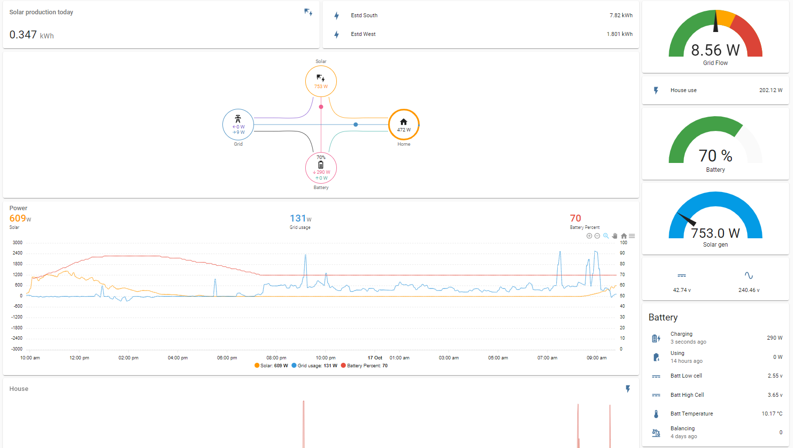
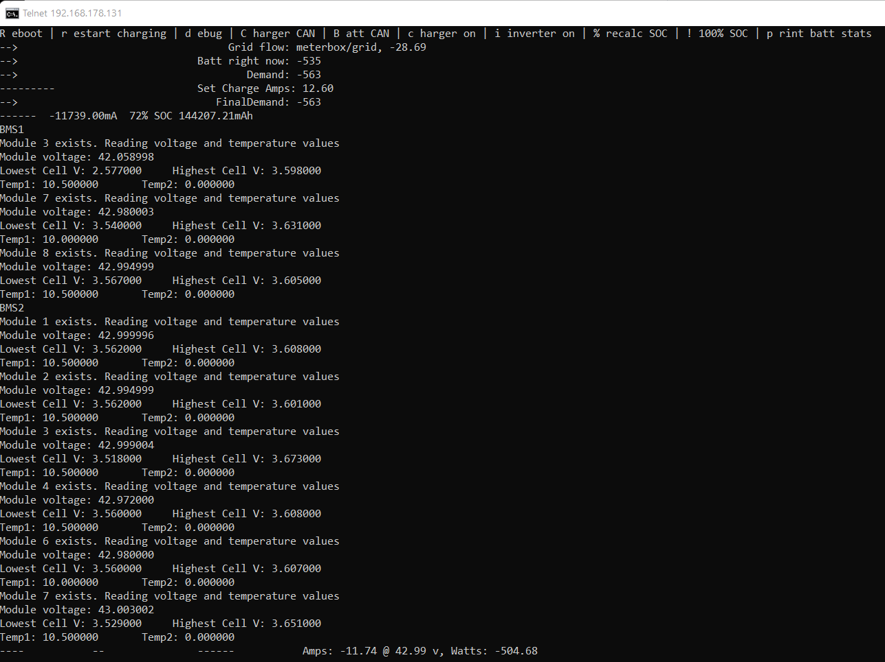

# Code for ESP32 to manage VW 44.4v batteries

Uses Vertiv / Emerson R48 Power Supply as the charger (included as submodule here; see below on cloning), SoyoSource GTN 1200 inverter via RS485, and interfaces with VW GTE battery packs via CAN bus. The ESP32 has one built-in CAN controller but this code uses MCP2515 transceivers to allow for multiple buses over shared SPI.

The job of this system is to respond to incoming MQTT messages of instantaneous in/out grid power and try to keep it to zero, by either charging or discharging the batteries. Code for energy meter publishing over MQTT in separate repository, but simply put this will subscribe to a tinyMQTT broker and expects a message every 500ms or so.

This has been designed for remote administration - it'll publish all sorts of data via MQTT so you can keep an eye on it and display nicely on homeassistant, and it uses the TelnetStream library to allow for remote commands and more detailed log following. Telnet is really simple - if you have the Windows feature turned on for example, just type "telnet <ip address>" in a command prompt and you'll get current status and a the keys to toggle debug modes, etc.

## Hardware 
  My set-up:
  - ESP32 ("ESP32 NodeMcu Development Board WROOM 32")
  - MCP2515 x3 ("Mcp2515 CAN Bus Module TJA1050 Receiver SPI Module")
      I have 2 BMS CAN buses due to duplicated module numbers, ordinarily 2 would be enough, one for the Vertiv PSU at 125kbps, one for VW modules at 500kbps
  - Vertiv R48-3000e3 PSU 
  - SoyoSource GTN-1200 48v (off AliExpress)
  - VW Golf GTE battery packs (1.086kWh, in a 12S format)
    - TE 1-1670990-1 connector each (you can use dupont jumpers easily)
    - 5 x "5-965906-1 AUTOMOTIVE CONTACT, SOCKET" per connector
    - M6 x 10mm bolts, two per battery
    - 16mm^2 cable and SC16-8 lugs
  - 100A / 75mV DC shunt (mine came with "Digital DC Watt Meter 12v 24v 48v Voltage Current Battery Monitor Solar Power" off ebay)
  - ADS1115 16-Bit ADC Analog Digital 4 Channel 
  - Max485 transceiver ("MAX485 TTL to RS-485 Converter Module 3.3v")
  
## Cloning

Because I've published the charger manager as a separate repo, it's included as a submodule here. To clone this project locally, use:
`git clone --recurse-submodules`
  
## Visualising Info
I'll put the definitions for my homeassistant display up somewhere. Nice to watch the battery status

  
You can see here one of my cells in the first 'module 3' is measuring incorrectly...

## Known limitations
  My SoyoSource inverter bottoms out at 43v so I'm only getting 40% of the battery's capacity. I have another 36v unit on the way that'll hopefully give us the rest, and up to 2kW where their working voltages overlap.
  Balancing doesn't seem perfect. Not sure if it's software or hardware yet... but one of my module 3's balances out with 5 cells at 0.1v lower than the other 7. And the other module 3 has one cell measuring way below what it really is
  

## Credits

https://github.com/Tom-evnut/VW-bms

https://github.com/hsaturn/TinyMqtt

https://github.com/syssi/esphome-soyosource-gtn-virtual-meter

https://github.com/ChrisHomewood/MQTT_to_Soyosource-Inverter_RS485

https://github.com/jandrassy/TelnetStream

https://github.com/vshymanskyy/Preferences
